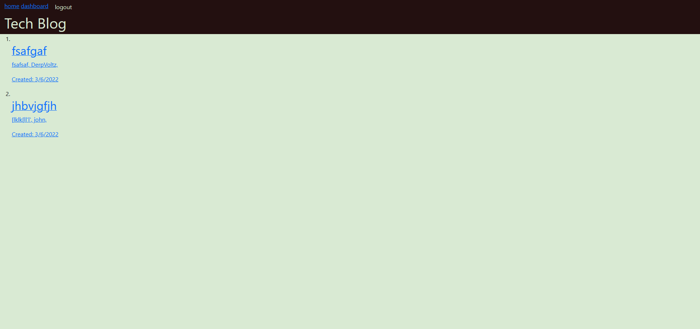

# tech-blog

## Description

This is a blog site where you can create posts, view other peoples posts, and comment on posts. When you initially go to the website you will end up on the homepage, the homepage will display all of the posts created on the websit. Then when you click login you can login if you have an acoount, if you do not have one then you can click on sign up and create one. Once you are logged in you can click on any of the posts on the homepage and comment on them, you can also got to your dashboard and create a new post. Once you create a post, it will show up on your dashboard, then you can click on edit and change the content of the post, you can also delete it. 

## Installation

To install this, all you need to do is clone the repo, run npm i, and create a .env file with DB_USER=, DB_PW=, and DB_NAME=tech_blog_db. Next open mysql and run db/schema.sql, and finally you can run npm start.

## Future Development

In the future, this website will be styled better. I will also add the ability to delete your own comments and comments on your posts.

## Deployed

[Website](https://stormy-ocean-88133.herokuapp.com/)

## Screenshot

